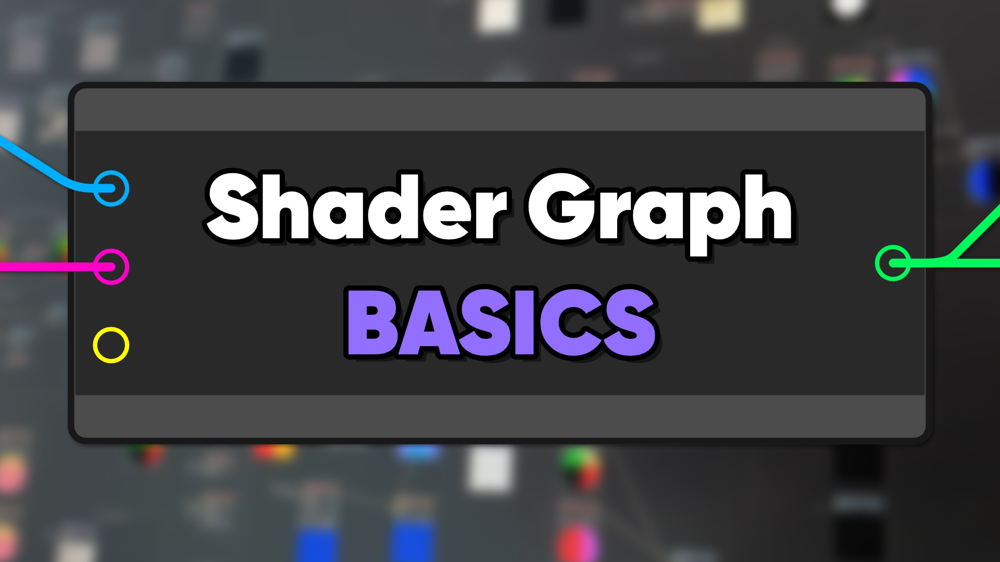

# Intro to Shader Graph in Unity 2022

A beginner crash course for Shader Graph in Unity 2022.3 and above.

## Overview

Shader Graph is a powerful tool that lets you create beautiful materials for your games. This repository contains some basic shaders which are intended to show you the features and possibilities supported by Shader Graph.

## Software

This project was created using Unity 2022.3.0f1 (Long-Term Support).

## Tutorials

This project is part of a tutorial series which is available in the following places:

- (coming soon)

## Authors

This project and the corresponding tutorials were created by Daniel Ilett.

## Release

The first part of this project was released on September 26th 2023.
